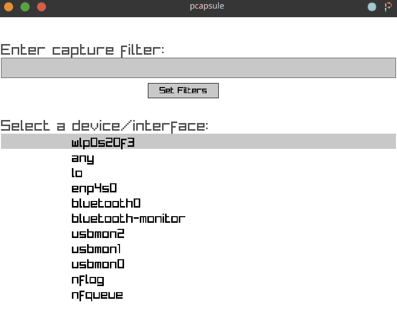

# Pcapsule

A network packet sniffer developed using **libpcap** and **raylib** in **C++**, allowing real-time capturing and analysis of IPv4 packets on both Windows and Linux.



---

### Dependencies

#### Windows
1. Download and install `npcap` from <https://npcap.com/#download>.
2. Follow the tutorial at [raylib Windows setup](https://github.com/raysan5/raylib/wiki/Working-on-Windows) or install it using [MSYS2](https://www.msys2.org/):
    ```bash
    pacman -S raylib
    ```

#### macOS
- Install `libpcap` and `raylib `using [Homebrew](https://brew.sh/):
    ```bash
    brew install libpcap raylib
    ```


#### Linux

- **Debian/Ubuntu-based systems:**
    ```bash
    sudo apt install libpcap-dev libraylib-dev
    ```

- **Fedora-based systems:**
    ```bash
    sudo dnf install libpcap-devel raylib-devel
    ```

- **Arch-based systems:**
    ```bash
    sudo pacman -S libpcap raylib
    ```

#### Nix/NixOS

If you're using **Nix** or **NixOS**, both `libpcap` and `raylib` are already included in the `default.nix` file. Just run:
```bash
nix-shell
```

---

## Building

To compile the program, you'll need `gcc`/`g++` with C++11 support or higher, and `GNU make`.

### On Windows, Linux, or macOS:
```bash
make
```

### Default Installation Paths

#### **Windows**
- **Executable:** `C:/Users/$(USERNAME)/AppData/Local/`
- **Icon:** `C:/Users/$(USERNAME)/AppData/Local/`
- **Desktop Shortcut:** `C:/Users/$(USERNAME)/Desktop/`

#### **Linux / Unix-like systems**
- **Executable:** `/home/$(USER)/.local/bin/`
- **Icon:** `/home/$(USER)/.local/share/icons/`
- **Desktop Shortcut:** `/home/$(USER)/Desktop/`

### Install the program:
```bash
make install
```

### Uninstall the program:
```bash
make uninstall
```

### Create a desktop shortcut (Windows and Linux only):
```bash
sudo make desktop
```

---

## Usage

- **Move** through the packet list using the **arrow keys**.
- **Click the textbox** to type a custom filter or use **“Select Device”** to apply filters automatically.
- Use the following **keyboard shortcuts** during capture:

  - `P` → Pause/Resume packet capture  
  - `ARROW KEYS` → Navigate through packets  
    - `↑ / ↓` → Move one packet at a time  
    - `← / →` → Scroll faster through the list  
  - `C` → Clear captured packets  
  - `D` → View packet **details** *(exit with `Esc`)*  
  - `S` → Save **all captured packets** in **CSV** format  
  - `R` → Toggle **Raw view mode**  
  - `Alt + F4` or **close window** → Return to main menu  

### In **Raw mode** (while viewing a specific packet):

  - `Esc` → Return to packet capture mode  
  - `S` → Save **current packet** in **CSV** format  
  - `A` → Save **current packet** in **ASCII .txt** format  
  - `E` → Save **current packet** in **Hex .txt** format  

> All saved files include a full timestamp in the filename.
